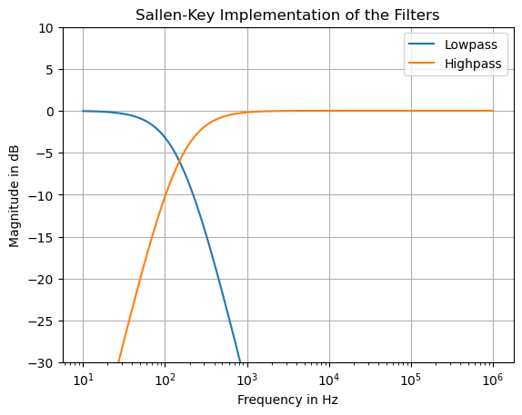
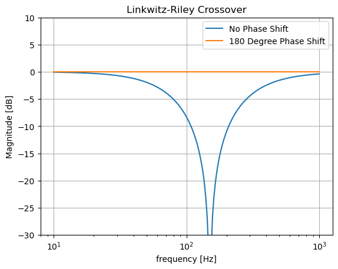
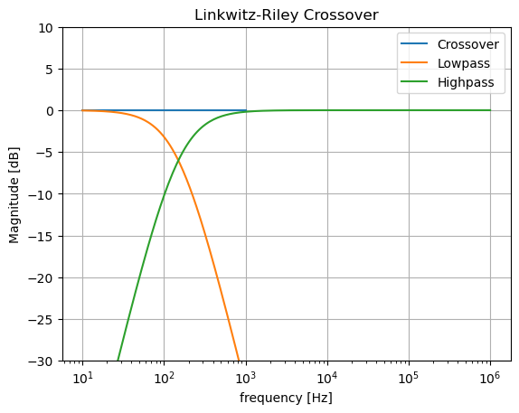

# Behavorial Model of the Linkwitz-riley crossover
This folder contains a mathematical reprensentation, also behavioral model, of the second order Linkwitz-Riley crossover (LRC). The behavioral model is implemented via python using jupyter notebook. The behaivoral model can provide an idea about how the LRC works and which results can be expected from it.

## Parameters of the behavorial model

Parameters for the second order LRC: 
* $f_\mathrm{0}=150\,\mathrm{Hz}$
* $Q_\mathrm{0}=\frac{1}{2}$
* Sallen-Key lowpass and highpass (Second order filters)

## Linkwitz-riley crossover

The behavioral model of the second order LRC is based on its transfer function. A second order LRC consists of a second order low- and highpass in parallel, which are both implemented via the Sallen-key topology. This means, that the LRC actually consists out of two seperat transferfunctions, which are combined in the end.
The second order lowpass in the LRC can be described with the following transferfunction.

$$
H(s)= \frac{\omega_\mathrm{0}^2}{s^2 + \frac{\omega_\mathrm{0}^2}{Q_\mathrm{0}} s + \omega_\mathrm{0}^2}
$$

And the second order Highpass as following.

$$
H(s) = \frac{s^2}{s^2 + \frac{\omega_\mathrm{0}^2}{Q_\mathrm{0}} s + \omega_\mathrm{0}^2}
$$

Because both filters are Butterworth like filters a smooth transitionband can be expected. Because of the Sallen-key topology, both filters are second order filters. The second order should result in $40\,\mathrm{dB}$ attenuation per decade for both filters.

The Magnitude response of both second order filters. 

The plot in figure above shows the magnitude response of both filtrs. The magnitude response of the lowpass (blue) and the highpass (orange) cross each other at $f_\mathrm{0}=150\,\mathrm{Hz}$ at $-6\,\mathrm{dB}$. The magnitude from both filters falls with roughly $-40\,\mathrm{dB}$ per decade. 

The filters together operate as frequency splitter. Because of the parallel implementation of the filters, the frequencies inside the incoming audio signal can be split into two bands. This filtersetup will seperate the bass from the rest of the audiospectrum.\
The two butterworth filters are designed in a way that, when the two magnitude responses are added together, the corresponding magnitude response would be at $0\,\text{dB}$, in other words, a flat line. This flat line of the corresponding magnitude response is wanted in audio community. The flat line means, that the outcoming audio signal is not distorted in any way. In Order to achive the flat line, one output signal from the filters has to be delayed by 180° or the transferfunction of one filter has to be inverted, before the two magnitude reponses can be added togehter. This because the output signals of both filters are 180° out of phase to each other. If the one signal is not delayed, the corresponding magnitude response would be a bandstop. In this case, the transferfunction of the highpass filter is inverted.

Magnitude reponse of the cross. The blue line represents the cross without an invertation of the highpass transferfunction and the orange line with an invertation of the highpass transferfucntion. 

The plot above shows the magnitude response of the cross. When the highpass transferfunction is not inverted (blue), the corresponding magnitude response is similar to a notch filter. This is due to the above mentioned fact. With the invertation of the highpass transferfuntion or the delay of the phase by 180°, the cross results in the wanted flat line.

Full magnitude response of the second order LRC. The orange line represents the second order lowpass, the green line the second order highpass and the blue line the corresponding magnitude response of the cross.

The plot in the figure above shows the full magnitude response of the second order LRC. The magnitude responses of the lowpass (orange) and the highpass (green) cross each other, like before, at $f_\mathrm{0}=150\,\mathrm{Hz}$ at $-6\,\mathrm{dB}$. The cross is at the wanted $0\,\mathrm{dB}$. This will cause no distortions to the audio signal.

 

