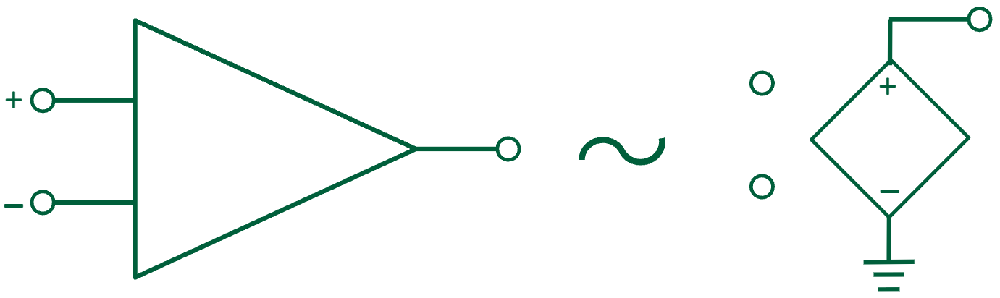
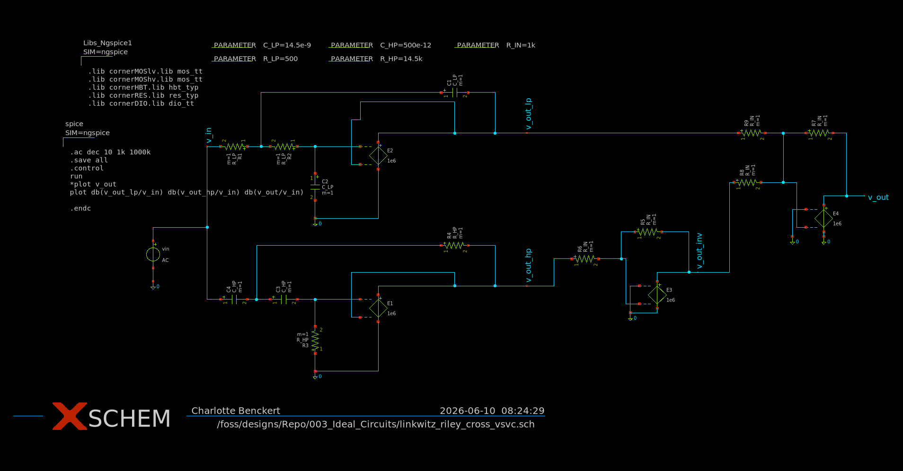
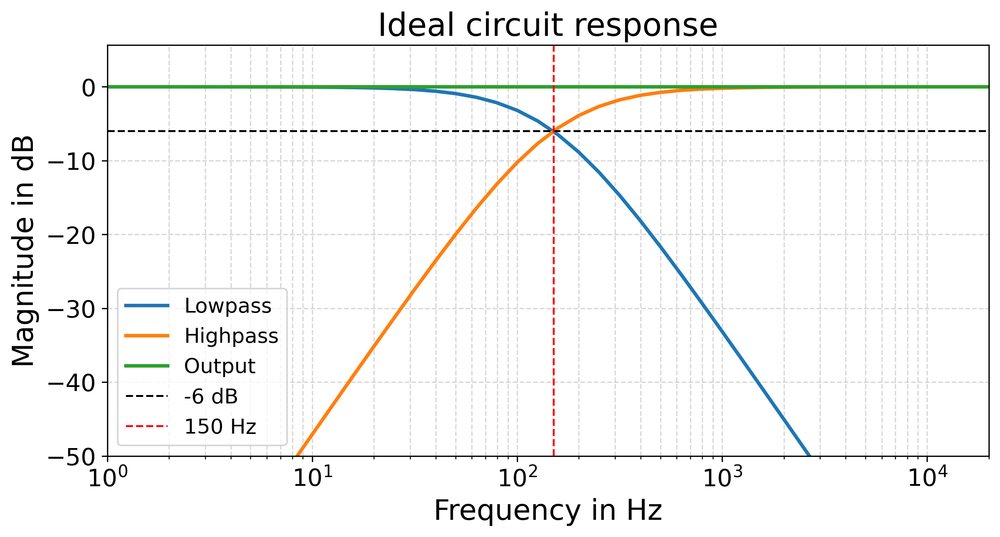

# Ideal circuit

The ideal circuit uses voltage controlled voltage sources (VCVS) as ideal operational amplifiers.
The following picture shows the setup.

The resulting schematic is shown in the next picture. As can be seen, the lowpass and highpass as well as the inverter and adder use a vcvs as their op-amp.

The resulting waveforms can be seen in the following figure.

The picture shows the lowpass response, the highpass response and the overall output. As expected the cross of high- and lowpass is at -6 dB and the output has a flat response.