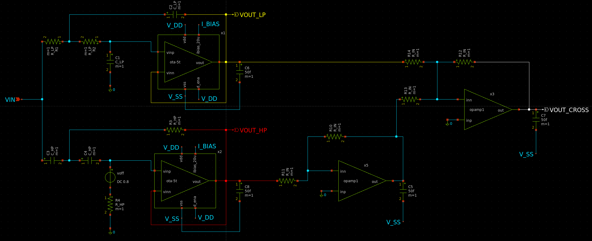
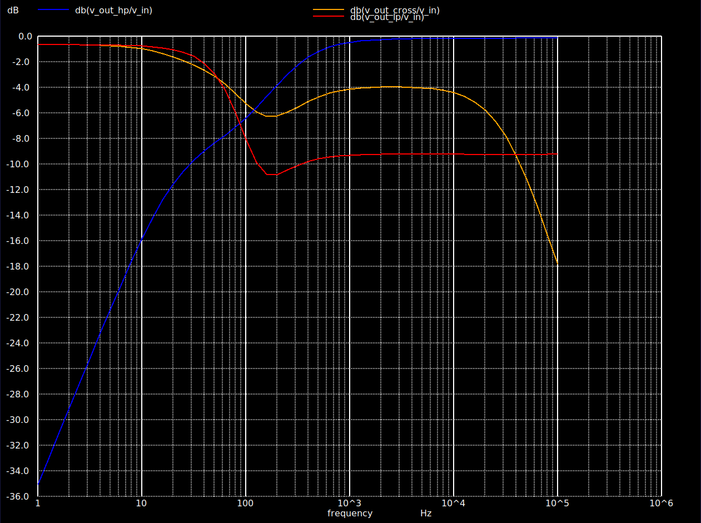
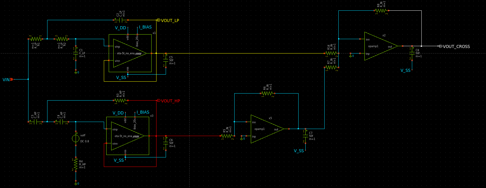
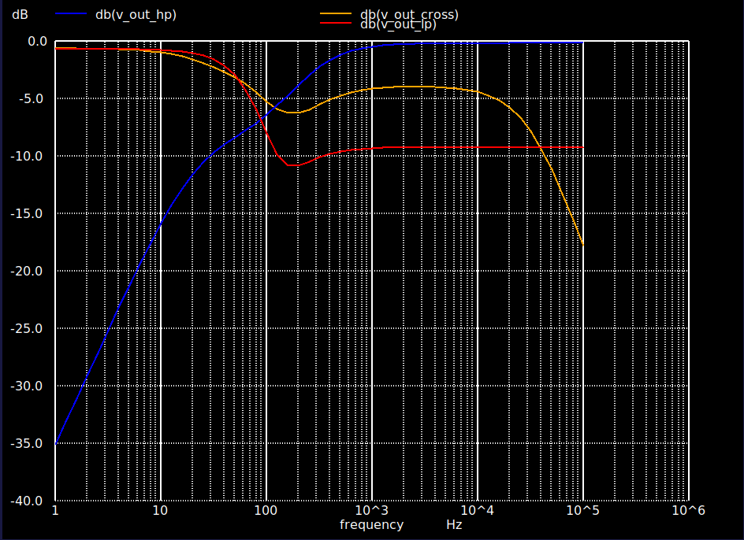
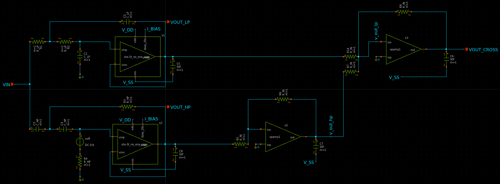
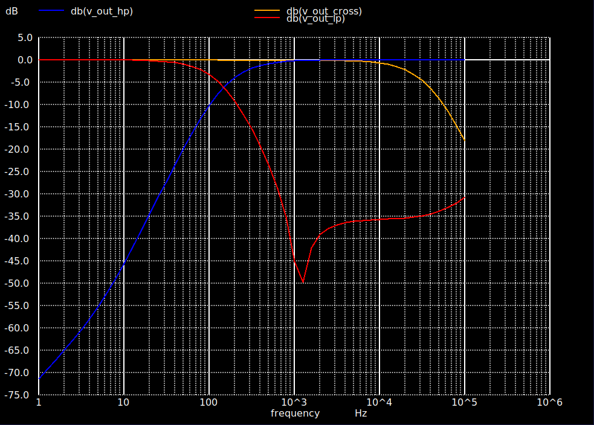

# Real circuits
This subfolder of the repository contains the designs of a linkwitz-riley-crossover (LRC) based on real OTA. The objective in this folder is to convert the LRC, based on ideal opamps, into a LRC which is based on a real OTA design. There three different variants of the OTA design. 

## Contents
| Folder  | Content |  Description   |
|-------|-----|-------|
| 000_ota_sizing_scripts | Sizing scripts  | This subfolder contains the sizing scripts, which are used to size the MOSFETs inside each OTA design. The sizing scripts are from Prof. Pretl. For the OTA designs in this folder, only the sizing script for the basic OTA is used. It is slightly modified, in order to size all MOSFETs in the OTA designs.|
| 001_version_basic_ota_pretl | Basic OTA | This folder contains a LRC design, which is based on the basic OTA design from Prof. Pretl|
| 002_version_no_enable | OTA without enable circuit | This folder contains a LRC design based on a OTA desing, which has the enable circuit removed. This OTA design is the simpliest design for an OTA. |
| 003_version_second_output_stage | OTA with extra Amplifier| This LRC design is based on the OTA design without the enable cirucit, but with an extra amplifier stage at the output of the differential input pair. |

## Technologie
The MOSFETs used for the OTA designs are based on the SG13G2 technology from IHP Microelectronics. This technologie is BiCMOs technology and is a 130nm process.[IHP Microelectronic](https://github.com/IHP-GmbH/IHP-Open-PDK/blob/main/ihp-sg13g2/libs.doc/doc/SG13G2_os_process_spec.pdf)

## linkwitz-riley crossover with the basic OTA from Prof. Pretl
This version of the Linkwitz-riley crossover is based on a unmodified version of the basic OTA from Prof. Pretl. This version is the starting piont of the design for real circuit and the first attempt to design a Linkwitz-Riley crossover based on a real OTA.

Schematic of the basic OTA desgin from Prof. Pretl.

The schematic in the figure above show the circuit of the basic OTA from Prof. Pretl. This designs is provided in his analog circuit design repository.[Analog-circuit-design Repository](https://github.com/iic-jku/analog-circuit-design)\
This OTA is a very simple design. Besides the MOSFETs M7 to M13, which are needed for the enable circuit of this OTA design, the core OTA design consist only out of six MOSFETs. This is the bare minmum amount of MOSFETs needed for a functional OTA design.\
The MOSFET M1 to M6 together form the core OTA circuit. Each MOSFET pair has a particular function in the OTA.
* The PMOS M3 and M4 form a current Mirror. These two MOSFETs are used as a form of drain resistor for the upcoming differential input pair.
* The NMOS M1 and M2 form the differential input pair of the OTA. These two MOSFETs form the differential signal, based on the voltage differenz between the input voltages $V_\mathrm{in,n}$ and $V_\mathrm{in,p}$ at the input terminals of the OTA.
* The two NMOS M6 and M5 create together the bias network for the differential input pair. The bias current is needed to bias the differential input pair M1 and M2 and to create the differential signal. This OTA needs a bias current of $I_\mathrm{bias}=20\,\mathrm{\mu A}$.

The MOSFETs M7 to M13 together create the enable circuit. This circuit allows the user to shutoff the OTA, without turning off the voltages $V_\mathrm{dd}$ or $V_\mathrm{ss}$.

In order to size each MOSFET properly, the sizing script from Prof. Pretl is used. The sizing parameters for the enable circuit MOSFETS (M7 to M13) have not been changed.
| MOSFET  | $gm/I_\mathrm{d}$| Length $L$| Width $W$| Comment   |
|-------|-----|-------|-------|-------|
| M1 | 12| $5\,\mathrm{\mu m}$| $2\,\mathrm{\mu m}$| In order to create a symmetrical OTA, M1 and M2 have to be sized with the same $gm/I_\mathrm{d}$|
| M2 | 12| $5\,\mathrm{\mu m}$| $2\,\mathrm{\mu m}$| In order to create a symmetrical OTA, M1 and M2 have to be sized with the same $gm/I_\mathrm{d}$|
| M3 | 8| $5\,\mathrm{\mu m}$| $3.5\,\mathrm{\mu m}$| In order to create a symmetrical OTA, M3 and M4 have to be sized with the same $gm/I_\mathrm{d}$|
| M4 | 8| $5\,\mathrm{\mu m}$| $3.5\,\mathrm{\mu m}$| In order to create a symmetrical OTA, M3 and M4 have to be sized with the same $gm/I_\mathrm{d}$|
| M5 | 8| $5\,\mathrm{\mu m}$| $1.5\,\mathrm{\mu m}$| In order to create a symmetrical OTA, M5 and M6 have to be sized with the same $gm/I_\mathrm{d}$|
| M6 | 8| $5\,\mathrm{\mu m}$| $10\,\mathrm{\mu m}$| In order to create a symmetrical OTA, M5 and M6 have to be sized with the same $gm/I_\mathrm{d}$|

Due to the $130\,\mathrm{nm}$ a smaller length than $L=5\,\mathrm{\mu m}$ would have been possible. However the decision was made to orientate this design at the design from Prof. Pretl. In his OTA designs, a length $L=5\,\mathrm{\mu m}$ is used for all MOSFETs.
### Schematic and response of the Linkwitz-Riley crossover

Schematic of the Linkwitz-Riley crossover circuit which uses the basic OTA design from Prof. Pretl.

The schematic above shows the circuit of the Linkwitz-Riley crossover which uses the basic OTA design from Prof. Pretl.\
The circuit with the OTA x1 is the Sallen-Key lowpass circuit. The parameters of the components are as following.
* $R_\mathrm{LP}=50\,\mathrm{k\Omega}$
* $C_\mathrm{LP}=22.221\,\mathrm{nF}$

The OTA x2 is used for the Sallen-key highpass circuit. The following values for the resistors and capacitors are used.
* $R_\mathrm{HP}=50\,\mathrm{k\Omega}$
* $C_\mathrm{HP}=22.221\,\mathrm{nF}$

For the inverter circuit and the adder circuit, ideal opamps are used. This is due to the fact, that the input signal at the inputs of the OTA has to be between $0.7\,\mathrm{V}$ and $0.9\,\mathrm{V}$. This cant be achieved with the output signals of the filters. This is also the reason for the voltage source $V_\mathrm{off}$ in the highpass circuit. The two capacitors in series to inverted input of the OTA block all DC voltages. Therefore the incoming AC voltage oscillates around ground potential. The voltage source gives an offset of $0.8\,\mathrm{V}$, so that the signal is inside the wanted voltage range. The resistors used in the inverter and adder circuit have a value of $R_\mathrm{IN}=1\,\mathrm{M\Omega}$.

Magntiude response of the Linkwitz-Riley crossover with the basic OTA from Prof. Pretl

The plot above shows the magnitude response of the Linkwitz-Riley crossover with the basic OTA from Prof. Pretl. The red line shows the second order Butterworth lowpass, the blue line the second order Butterworth highpass and the orange line the sum of both.\
Clearly visible is that, the cross line is not flat at all. It is not even near the anticipated $0\,\mathrm{dB}$ mark. It dips around the same time, as the lowpass. The reason for this is, that the low- and the highpass dont have enough attenuation in their stopband and doenst reach the $-40\,\mathrm{dB}$ per decade in the transistionband. The lowpass only reaches an attenuation of around $-9\,\mathrm{dB}$ in its stopband, which is not good at all. Even the cross of both magnitude responses are not at the desired frequency and not at $-6\,\mathrm{dB}$. Instead they cross each other by $95\,\mathrm{Hz}$ at around $-7\,\mathrm{dB}$.

## Linkwitz-Riley crossover with the modified basic OTA design
This LRC uses a modified version of the basic OTA design from Prof. Pretl. 

Schematic of the modified OTA. The enable circuit got removed.

The OTA design in the schematic above is used in the second LRC design. This OTA design is a modified version of the basic OTA design from Prof. Pretl. The enable circuit is removed for the sake of simplicity.\
Only the MOSFET which are necessary for the OTA to function properly are left in this design. The functionality of the MOSFETs stays the same.

* M3/M4 are PMOS, which create the upper current mirror.
* M1/M2 are NMOS and create the differential input pair.
* M5/M6 are NMOS and create the bias network for the differential input pair.

Because this OTA design is the same core OTA design as in Prof. Pretls design, the same sizing script can be used. There are no changes to the $gm/I_\mathrm{d}$ of each MOSFET pair.

| MOSFET  | $gm/I_\mathrm{d}$| Length $L$| Width $W$| Comment   |
|-------|-----|-------|-------|-------|
| M1 | 12| $5\,\mathrm{\mu m}$| $2\,\mathrm{\mu m}$| In order to create a symmetrical OTA, M1 and M2 have to be sized with the same $gm/I_\mathrm{d}$|
| M2 | 12| $5\,\mathrm{\mu m}$| $2\,\mathrm{\mu m}$| In order to create a symmetrical OTA, M1 and M2 have to be sized with the same $gm/I_\mathrm{d}$|
| M3 | 8| $5\,\mathrm{\mu m}$| $3.5\,\mathrm{\mu m}$| In order to create a symmetrical OTA, M3 and M4 have to be sized with the same $gm/I_\mathrm{d}$|
| M4 | 8| $5\,\mathrm{\mu m}$| $3.5\,\mathrm{\mu m}$| In order to create a symmetrical OTA, M3 and M4 have to be sized with the same $gm/I_\mathrm{d}$|
| M5 | 8| $5\,\mathrm{\mu m}$| $1.5\,\mathrm{\mu m}$| In order to create a symmetrical OTA, M5 and M6 have to be sized with the same $gm/I_\mathrm{d}$|
| M6 | 8| $5\,\mathrm{\mu m}$| $10\,\mathrm{\mu m}$| In order to create a symmetrical OTA, M5 and M6 have to be sized with the same $gm/I_\mathrm{d}$|

Because there were no changes made to the requierments for the OTA, the sizing of each MOSFET stays the same as before.

### Schematic and response of the Linkwitz-Riley crossover

Schematic of the Linkwitz-Riley crossover circuit which uses the modified OTA design. 

The circuit used for the LRC is the same as before. The OTA x1 is used for the Sallen-Key Lowpass. The values of the components stay the same.
* $R_\mathrm{LP}=50\,\mathrm{k\Omega}$
* $C_\mathrm{LP}=22.221\,\mathrm{nF}$

The OTA x2 is used for the Sallen-key highpass circuit. The following values for the resistors and capacitors are used.
* $R_\mathrm{HP}=50\,\mathrm{k\Omega}$
* $C_\mathrm{HP}=22.221\,\mathrm{nF}$

Also the inverter circuit and the addition circuit stay the same. The values of the resistors used in this circuit stays at $R_\mathrm{IN}=1\,\mathrm{M\Omega}$.\
The only difference to the circuit before is, that there is no more enable pin at the OTA symbol. This pin is missing, because there is no more enable circuit inside the OTA.

Schematic of the Linkwitz-Riley crossover circuit which uses the modified OTA design. 

The magnitude response of this LRC is basicly the same as before. This is due to the same core design of OTAs. No improvments are achieved by the new design of the OTA.

## Linkwitz-Riley crossover with an added amplifier at its output
This Version of the linkwitz-riley-crossover is based on the final OTA design.

Schematic of the OTA with a second common source amplifier at the output of the differenital input pair.

The figure above shows the final design of the OTA. The desgn is similiar to the OTA design with the enable circuit removed. The core design of the OTA stays the same.

* M3/M4 are PMOS, which create the upper current mirror.
* M1/M2 are NMOS and create the differential input pair.
* M5/M6 are NMOS and create the bias network for the differential input pair.

New in comparison to the old design are the MOSFETs M7 and M8 and furthermore the resistor R1 and the capacitor C2.\
The MOSFETs together create the second output stage. The PMOS M7 is the amplifier and the NMOS M8 is used to bias the amplifier. The amplifier stage needs only half of the bias current as needed for the differential pair. This due to fact, that only one, instead of two, common source amplifier is used in the second stage. That is also the reason for the fact, that only $I_\mathrm{bias,output}=\frac{I_\mathrm{bias,diff}}{2}=10\,\mathrm{\mu A}$ is needed to bias the output amplifier stage. The overall bias current needed for this OTA design therefore increase to $I_\mathrm{bias}=30\,\mathrm{\mu A}$.\
The reistor $R_\mathrm{1}$ and the capacitor $C_\mathrm{2}$ are there to stabilze the OTA. Because of the multiple stage amplifier design, multiple poles are present. These poles cause ripples in the magnitude response of the OTA and significantly the phase margin of the OTA. In order to improve the magnitude response and the phase margin of the OTA, a feedback capacitor can be added between the output of the differential input pair and the outpur of the second amplifier. This is knwon as miller compensation. The feedback capacitor will create a dominant pole in the lower frequency domain and will push the other poles into the higher frequency domain, out of the operation are of this OTA. This method is called pole splitting and is one of the more common methods, in order to stabilize the OTA. These method has two major side effects:
* It reduces the bandwith and therefore also the gain-bandwidth-producht (GBW)
* The feedback capacitor introduces a zero, which provides gain instead of attenuation.
 
This zero will create a spike in the magnitude response of the OTA, which can lead to a potential unstable system again. The zero is located inside the right side of the s-plane. With the help of a resistor in series to the feedback capacitor, the location of the zero can be altered. The zero can be even pushed into the left side of the s-plane. This will dampend the spike and stabilize the OTA again.\
In order to size the OTA, the sizing script form Prof. Pretl has to be modified. The calculation capability for the output amplifier has to be added. With this calculation added, the OTA can be sized.
  
| MOSFET  | $gm/I_\mathrm{d}$| Length $L$| Width $W$| Comment   |
|-------|-----|-------|-------|-------|
| M1 | 12| $5\,\mathrm{\mu m}$| $2\,\mathrm{\mu m}$| In order to create a symmetrical OTA, M1 and M2 have to be sized with the same $gm/I_\mathrm{d}$|
| M2 | 12| $5\,\mathrm{\mu m}$| $2\,\mathrm{\mu m}$| In order to create a symmetrical OTA, M1 and M2 have to be sized with the same $gm/I_\mathrm{d}$|
| M3 | 8| $5\,\mathrm{\mu m}$| $3.5\,\mathrm{\mu m}$| In order to create a symmetrical OTA, M3 and M4 have to be sized with the same $gm/I_\mathrm{d}$|
| M4 | 8| $5\,\mathrm{\mu m}$| $3.5\,\mathrm{\mu m}$| In order to create a symmetrical OTA, M3 and M4 have to be sized with the same $gm/I_\mathrm{d}$|
| M5 | 8| $5\,\mathrm{\mu m}$| $1.5\,\mathrm{\mu m}$| In order to create a symmetrical OTA, M5 and M6 have to be sized with the same $gm/I_\mathrm{d}$|
| M6 | 8| $5\,\mathrm{\mu m}$| $10\,\mathrm{\mu m}$| In order to create a symmetrical OTA, M5 and M6 have to be sized with the same $gm/I_\mathrm{d}$|
| M7 | 12| $5\,\mathrm{\mu m}$| $8.5\,\mathrm{\mu m}$| The PMOS of the output amplifier is sized with the $gm/I_\mathrm{d}$, as for the diffrenital input pair M1 and M2.
| M8 | 8| $5\,\mathrm{\mu m}$| $0.75\,\mathrm{\mu m}$| This MOSFET needs to be half the width of M5, because only half of the bias current is needed to bias the output amplifier M7|

### Schematic and response of the Linkwitz-Riley crossover

Schematic of Linkwitz-Riley crossover circuit which uses the OTA design with an extra amplifer stage at the output of the differential input pair.

 The circuit used for the LRC is same as before. The OTA x1 is used as Sallen-Key lowpass.

* $R_\mathrm{LP}=50\,\mathrm{k\Omega}$
* $C_\mathrm{LP}=22.221\,\mathrm{nF}$

The OTA x2 is used as a Sallen-key highpass. The following values for the resistors and capacitors are used.
* $R_\mathrm{HP}=50\,\mathrm{k\Omega}$
* $C_\mathrm{HP}=22.221\,\mathrm{nF}$

The resistors values used in for the inverter circuit and the adder circuit stays at 
$R_\mathrm{IN}=1\,\mathrm{M\Omega}$.

Magnitude response of the Linkwitz-Riley crossover. 

