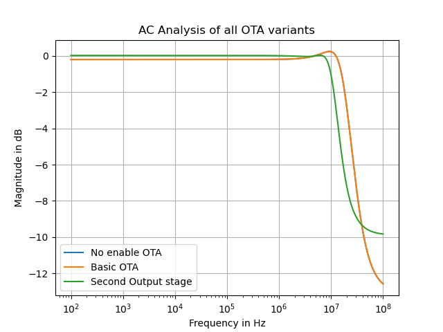
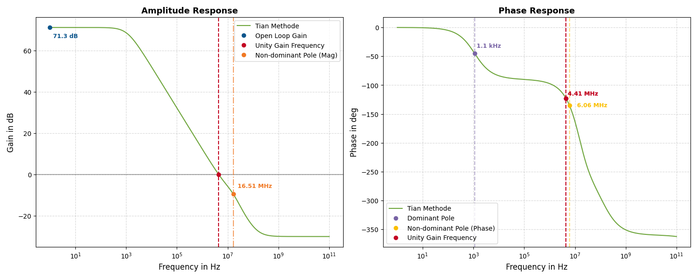
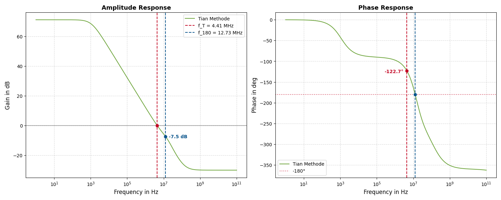
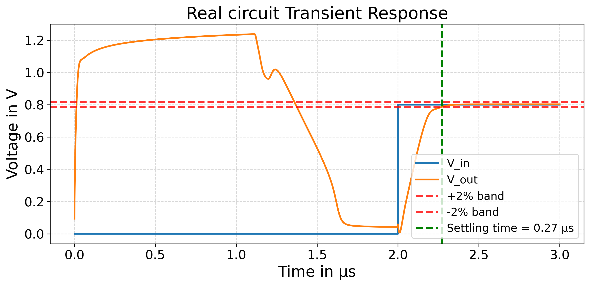
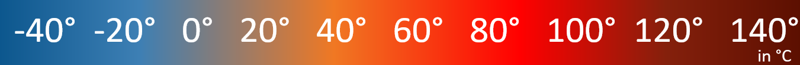
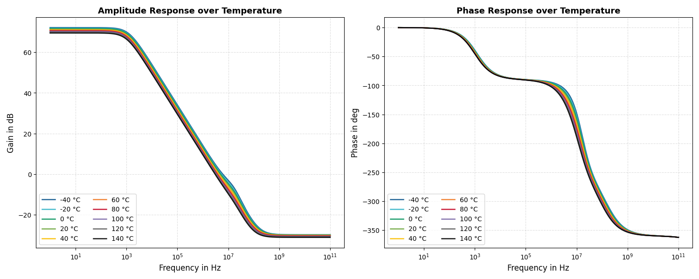
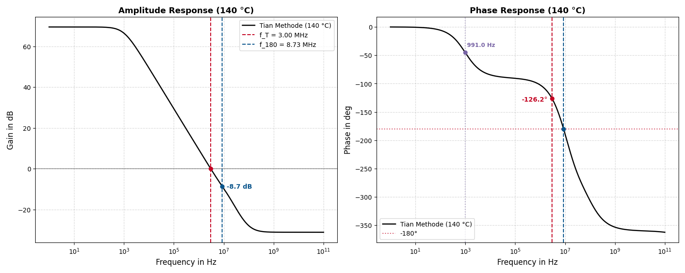

# Real circuits
This subfolder of the repository contains the designs of a linkwitz-riley-crossover (LRC) based on real OTA. The objective in this folder is to convert the LRC, based on ideal opamps, into a LRC which is based on a real OTA design. There three different variants of the OTA design. 

## Contents
| Folder  | Content |  Description   |
|-------|-----|-------|
| 000_ota_sizing_scripts | Sizing scripts  | This subfolder contains the sizing scripts, which are used to size the MOSFETs inside each OTA design. The sizing scripts are from Prof. Pretl. For the OTA designs in this folder, only the sizing script for the basic OTA is used. It is slightly modified, in order to size all MOSFETs in the OTA designs.|
| 001_version_basic_ota_pretl | Basic OTA | This folder contains a LRC design, which is based on the basic OTA design from Prof. Pretl|
| 002_version_no_enable | OTA without enable circuit | This folder contains a LRC design based on a OTA desing, which has the enable circuit removed. This OTA design is the simpliest design for an OTA. |
| 003_version_second_output_stage | OTA with extra Amplifier| This LRC design is based on the OTA design without the enable cirucit, but with an extra amplifier stage at the output of the differential input pair. |

## Technologie
The MOSFETs used for the OTA designs are based on the SG13G2 technology from IHP Microelectronics. This technologie is BiCMOs technology and is a 130nm process.[IHP Microelectronic](https://github.com/IHP-GmbH/IHP-Open-PDK/blob/main/ihp-sg13g2/libs.doc/doc/SG13G2_os_process_spec.pdf)

## linkwitz-riley crossover with the basic OTA from Prof. Pretl
This version of the Linkwitz-riley crossover is based on a unmodified version of the basic OTA from Prof. Pretl. This version is the starting piont of the design for real circuit and the first attempt to design a Linkwitz-Riley crossover based on a real OTA.

Schematic of the basic OTA desgin from Prof. Pretl.

The schematic in the figure above show the circuit of the basic OTA from Prof. Pretl. This designs is provided in his analog circuit design repository.[Analog-circuit-design Repository](https://github.com/iic-jku/analog-circuit-design). This OTA is a very simple design. Besides the MOSFETs M7 to M13, which are needed for the enable circuit of this OTA design, the core OTA design consist only out of six MOSFETs.

Parameters:
* $V_\mathrm{dd}=1.45\,\mathrm{V}<1.5\,\mathrm{V}<1.55\,\mathrm{V}$
* $V_\mathrm{ss}=0\,\mathrm{V}$
* $V_\mathrm{in,n/in,p}=0.7\,\mathrm{V}<0.8\,\mathrm{V}<0.9\,\mathrm{V}$
* $I_\mathrm{bias}=20\,\mathrm{\mu A}$

Functionality of the MOSFETs:
* The PMOS M3 and M4 form a current Mirror. These two MOSFETs are used as a form of drain resistor for the upcoming differential input pair.
* The NMOS M1 and M2 form the differential input pair of the OTA. These two MOSFETs form the differential signal, based on the voltage differenz between the input voltages $V_\mathrm{in,n}$ and $V_\mathrm{in,p}$ at the input terminals of the OTA.
* The two NMOS M6 and M5 create together the bias network for the differential input pair. The bias current is needed to bias the differential input pair M1 and M2 and to create the differential signal. This OTA needs a bias current of $I_\mathrm{bias}=20\,\mathrm{\mu A}$.

The MOSFETs M7 to M13 together create the enable circuit. This circuit allows the user to shutoff the OTA, without turning off the voltages $V_\mathrm{dd}$ or $V_\mathrm{ss}$.

In order to size each MOSFET properly, the sizing script from Prof. Pretl is used. The sizing parameters for the enable circuit MOSFETS (M7 to M13) have not been changed.
| MOSFET  | $gm/I_\mathrm{d}$| Length $L$| Width $W$| Comment   |
|-------|-----|-------|-------|-------|
| M1 | 12| $5\,\mathrm{\mu m}$| $2\,\mathrm{\mu m}$| In order to create a symmetrical OTA, M1 and M2 have to be sized with the same $gm/I_\mathrm{d}$|
| M2 | 12| $5\,\mathrm{\mu m}$| $2\,\mathrm{\mu m}$| In order to create a symmetrical OTA, M1 and M2 have to be sized with the same $gm/I_\mathrm{d}$|
| M3 | 8| $5\,\mathrm{\mu m}$| $3.5\,\mathrm{\mu m}$| In order to create a symmetrical OTA, M3 and M4 have to be sized with the same $gm/I_\mathrm{d}$|
| M4 | 8| $5\,\mathrm{\mu m}$| $3.5\,\mathrm{\mu m}$| In order to create a symmetrical OTA, M3 and M4 have to be sized with the same $gm/I_\mathrm{d}$|
| M5 | 8| $5\,\mathrm{\mu m}$| $1.5\,\mathrm{\mu m}$| In order to create a symmetrical OTA, M5 and M6 have to be sized with the same $gm/I_\mathrm{d}$|
| M6 | 8| $5\,\mathrm{\mu m}$| $10\,\mathrm{\mu m}$| In order to create a symmetrical OTA, M5 and M6 have to be sized with the same $gm/I_\mathrm{d}$|

Due to the $130\,\mathrm{nm}$ a smaller length than $L=5\,\mathrm{\mu m}$ would have been possible. However the decision was made to orientate this design at the design from Prof. Pretl. In his OTA designs, a length $L=5\,\mathrm{\mu m}$ is used for all MOSFETs.
### Schematic and response of the Linkwitz-Riley crossover

Schematic of the Linkwitz-Riley crossover circuit which uses the basic OTA design from Prof. Pretl.

The schematic above shows the circuit of the Linkwitz-Riley crossover which uses the basic OTA design from Prof. Pretl.\
The circuit with the OTA x1 is the Sallen-Key lowpass circuit. The parameters of the components are as following.
* $R_\mathrm{LP}=50\,\mathrm{k\Omega}$
* $C_\mathrm{LP}=22.221\,\mathrm{nF}$

The OTA x2 is used for the Sallen-key highpass circuit. The following values for the resistors and capacitors are used.
* $R_\mathrm{HP}=22.221\,\mathrm{k\Omega}$
* $C_\mathrm{HP}=50\,\mathrm{nF}$

For the inverter and adder circuit:
* $R_\mathrm{IN}=1\,\mathrm{M\Omega}$

For the inverter and the adder circuit, ideal opamps are used. This is due to the fact, that they don't have any effect on the performance of the lowpass and highpass. Only these two OTAs are relevant. The reason for the voltage source at the inverting input of x2 is, that the input voltage has to be between $0.7\,\mathrm{V}$ and $0.9\,\mathrm{V}$. This is achieved by DC offset of $0.8\,\mathrm{V}$ with the input signal, but the capcitors $C_\mathrm{3}$ and $C_\mathrm{4}$ block all incoming DC voltages. So the voltage source gives the input signal the necessary offset voltage $0.8\,\mathrm{V}$.

Magntiude response of the Linkwitz-Riley crossover with the basic OTA from Prof. Pretl

The plot above shows the magnitude response of the Linkwitz-Riley crossover with the basic OTA from Prof. Pretl. The blue line shows the second order Butterworth lowpass, the green line the second order Butterworth highpass and the orange line the sum of both.\
Clearly visible is that, the cross line is not flat at all. It is not even near the anticipated $0\,\mathrm{dB}$ mark. It dips around the same time, as the lowpass. The reason for this is, that the low- and the highpass dont have enough attenuation in their stopband and doens't reach the $-40\,\mathrm{dB}$ per decade in the transistionband. The lowpass only reaches an attenuation of around $-9\,\mathrm{dB}$ in its stopband, which is not good at all. Even the cross of both magnitude responses are not at the desired frequency and not at $-6\,\mathrm{dB}$. Instead they cross each other by $87\,\mathrm{Hz}$ at around $-6.8\,\mathrm{dB}$.

## Linkwitz-Riley crossover with the modified basic OTA design
This LRC uses a modified version of the basic OTA design from Prof. Pretl. 

Schematic of the modified OTA. The enable circuit got removed.

The OTA design in the schematic above is used in the second LRC design. This OTA design is a modified version of the basic OTA design from Prof. Pretl. The enable circuit is removed for the sake of simplicity.

Parameters:
* $V_\mathrm{dd}=1.45\,\mathrm{V}<1.5\,\mathrm{V}<1.55\,\mathrm{V}$
* $V_\mathrm{ss}=0\,\mathrm{V}$
* $V_\mathrm{in,n/in,p}=0.7\,\mathrm{V}<0.8\,\mathrm{V}<0.9\,\mathrm{V}$
* $I_\mathrm{bias}=20\,\mathrm{\mu A}$

This design contains only the MOSFET which are necessary for the OTA to function properly. The functionality of the MOSFETs stays the same.

* M3/M4 are PMOS, which create the upper current mirror.
* M1/M2 are NMOS and create the differential input pair.
* M5/M6 are NMOS and create the bias network for the differential input pair.

Because this OTA design is the same core OTA design as in Prof. Pretls design, the same sizing script can be used. There are no changes to the $gm/I_\mathrm{d}$ of each MOSFET pair.

| MOSFET  | $gm/I_\mathrm{d}$| Length $L$| Width $W$| Comment   |
|-------|-----|-------|-------|-------|
| M1 | 12| $5\,\mathrm{\mu m}$| $2\,\mathrm{\mu m}$| In order to create a symmetrical OTA, M1 and M2 have to be sized with the same $gm/I_\mathrm{d}$|
| M2 | 12| $5\,\mathrm{\mu m}$| $2\,\mathrm{\mu m}$| In order to create a symmetrical OTA, M1 and M2 have to be sized with the same $gm/I_\mathrm{d}$|
| M3 | 8| $5\,\mathrm{\mu m}$| $3.5\,\mathrm{\mu m}$| In order to create a symmetrical OTA, M3 and M4 have to be sized with the same $gm/I_\mathrm{d}$|
| M4 | 8| $5\,\mathrm{\mu m}$| $3.5\,\mathrm{\mu m}$| In order to create a symmetrical OTA, M3 and M4 have to be sized with the same $gm/I_\mathrm{d}$|
| M5 | 8| $5\,\mathrm{\mu m}$| $1.5\,\mathrm{\mu m}$| In order to create a symmetrical OTA, M5 and M6 have to be sized with the same $gm/I_\mathrm{d}$|
| M6 | 8| $5\,\mathrm{\mu m}$| $10\,\mathrm{\mu m}$| In order to create a symmetrical OTA, M5 and M6 have to be sized with the same $gm/I_\mathrm{d}$|

Because there were no changes made to the requierments for the OTA, the sizing of each MOSFET stays the same as before.

### Schematic and response of the Linkwitz-Riley crossover

Schematic of the Linkwitz-Riley crossover circuit which uses the modified OTA design. 

The circuit used for the LRC is the same as before. The OTA x1 is used for the Sallen-Key Lowpass. The values of the components stay the same.
* $R_\mathrm{LP}=50\,\mathrm{k\Omega}$
* $C_\mathrm{LP}=22.221\,\mathrm{nF}$

The OTA x2 is used for the Sallen-key highpass circuit. The following values for the resistors and capacitors are used.
* $R_\mathrm{HP}=22.221\,\mathrm{k\Omega}$
* $C_\mathrm{HP}=50\,\mathrm{nF}$

For the inverter and adder circuit:
* $R_\mathrm{IN}=1\,\mathrm{M\Omega}$

Also the inverter circuit and the addition circuit stay the same. Only difference is the removed enable pin for the OTAs.

Schematic of the Linkwitz-Riley crossover circuit which uses the modified OTA design. 

The magnitude response of this LRC is basicly the same as before. This is due to the same core design of OTAs. No improvments are achieved with the new design of the OTA.

## Linkwitz-Riley crossover with an added amplifier at its output
This Version of the linkwitz-riley-crossover is based on the final OTA design.

Schematic of the OTA with a second common source amplifier at the output of the differenital input pair.

Parameters:
* $V_\mathrm{dd}=1.45\,\mathrm{V}<1.5\,\mathrm{V}<1.55\,\mathrm{V}$
* $V_\mathrm{ss}=0\,\mathrm{V}$
* $V_\mathrm{in,n/in,p}=0.7\,\mathrm{V}<0.8\,\mathrm{V}<0.9\,\mathrm{V}$
* $I_\mathrm{bias}=30\,\mathrm{\mu A}$

The figure above shows the final design of the OTA. The desgn is similiar to the OTA design with the enable circuit removed. The core design of the OTA stays the same. New to the design are the MOSFETs M7 and M8 and the resistor $R_\mathrm{1}$ and the capacitor $C_\mathrm{2}$.

* M3/M4 are PMOS, which create the upper current mirror.
* M1/M2 are NMOS and create the differential input pair.
* M5/M6 are NMOS and create the bias network for the differential input pair.
* M7 is a PMOS and is used to amplify the signal coming from the differential input pair.
* M8 is a NMOS and used to bias the PMOS M7
* The resistor $R_\mathrm{1}$ and the capacitor $C_\mathrm{2}$ are used for the Miller compensation.

The second amplifier needs only half of the bias current as needed for the differential pair. This due to fact that only one, instead of two, common source amplifier is used in the second stage. Therefore only $I_\mathrm{bias}=10\,\mathrm{\mu A}$ is needed for the second amplifier.\
The reistor $R_\mathrm{1}$ and the capacitor $C_\mathrm{2}$ are there to stabilze the OTA. Because of the multiple stage amplifier design, multiple poles are present. These poles cause ripples in the magnitude response of the OTA and significantly the phase margin of the OTA. In order to improve the magnitude response and the phase margin of the OTA, a feedback capacitor can be added between the output of the differential input pair and the outpur of the second amplifier. This is knwon as miller compensation. The feedback capacitor will create a dominant pole in the lower frequency domain and will push the other poles into the higher frequency domain, out of the operation are of this OTA. This method is called pole splitting and is one of the more common methods, in order to stabilize the OTA. These method has two major side effects:

* It reduces the bandwith and therefore also the gain-bandwidth-producht (GBW)
* The feedback capacitor introduces a zero, which provides gain instead of attenuation.
 
This zero will create a spike in the magnitude response of the OTA, which can lead to a potential unstable system again. The zero is located inside the right side of the s-plane. With the help of a resistor in series to the feedback capacitor, the location of the zero can be altered. The zero can be even pushed into the left side of the s-plane. This will dampend the spike and stabilize the OTA again.\
In order to size the OTA, the sizing script form Prof. Pretl has to be modified. The calculation capability for the output amplifier has to be added. With this calculation added, the OTA can be sized.
  
| MOSFET  | $gm/I_\mathrm{d}$| Length $L$| Width $W$| Comment   |
|-------|-----|-------|-------|-------|
| M1 | 12| $5\,\mathrm{\mu m}$| $2\,\mathrm{\mu m}$| In order to create a symmetrical OTA, M1 and M2 have to be sized with the same $gm/I_\mathrm{d}$|
| M2 | 12| $5\,\mathrm{\mu m}$| $2\,\mathrm{\mu m}$| In order to create a symmetrical OTA, M1 and M2 have to be sized with the same $gm/I_\mathrm{d}$|
| M3 | 8| $5\,\mathrm{\mu m}$| $3.5\,\mathrm{\mu m}$| In order to create a symmetrical OTA, M3 and M4 have to be sized with the same $gm/I_\mathrm{d}$|
| M4 | 8| $5\,\mathrm{\mu m}$| $3.5\,\mathrm{\mu m}$| In order to create a symmetrical OTA, M3 and M4 have to be sized with the same $gm/I_\mathrm{d}$|
| M5 | 8| $5\,\mathrm{\mu m}$| $1.5\,\mathrm{\mu m}$| In order to create a symmetrical OTA, M5 and M6 have to be sized with the same $gm/I_\mathrm{d}$|
| M6 | 8| $5\,\mathrm{\mu m}$| $10\,\mathrm{\mu m}$| In order to create a symmetrical OTA, M5 and M6 have to be sized with the same $gm/I_\mathrm{d}$|
| M7 | 12| $5\,\mathrm{\mu m}$| $8.5\,\mathrm{\mu m}$| The PMOS of the output amplifier is sized with the $gm/I_\mathrm{d}$, as for the diffrenital input pair M1 and M2.
| M8 | 8| $5\,\mathrm{\mu m}$| $0.75\,\mathrm{\mu m}$| This MOSFET needs to be half the width of M5, because only half of the bias current is needed to bias the output amplifier M7|

### Schematic and response of the Linkwitz-Riley crossover

Schematic of Linkwitz-Riley crossover circuit which uses the OTA design with an extra amplifer stage at the output of the differential input pair.

 The circuit used for the LRC is same as before. The OTA x1 is used as Sallen-Key lowpass.

* $R_\mathrm{LP}=50\,\mathrm{k\Omega}$
* $C_\mathrm{LP}=22.221\,\mathrm{nF}$

The OTA x2 is used as a Sallen-key highpass. The following values for the resistors and capacitors are used.
* $R_\mathrm{HP}=22.221\,\mathrm{k\Omega}$
* $C_\mathrm{HP}=50\,\mathrm{nF}$

The resistors values used in for the inverter circuit and the adder circuit stays at 
$R_\mathrm{IN}=1\,\mathrm{M\Omega}$.

Magnitude response of the Linkwitz-Riley crossover. 

This version of the Linkwitz-Riley crossover finaly has the desired results. The crossover is constant at $0\,\mathrm{dB}$ and the magnitude response of the lowpass and the highpass cross each other by $150\,\mathrm{Hz}$ and at $-6\,\mathrm{dB}$. Also both filters reach the desired $40\,\mathrm{dB}$ attenuation per decade in the transistionband.\
After $10\,\mathrm{kHz}$ the crossover begins to dip. This might be due to the ripple in the stopband of the lowpass filter. At present, the cause of the ripples remains unknown.

## Analysis of OTA

The designed OTA is analysed in frequency domain, time domain as well as an loopgain analysis. These three analysis are repeated with a temperature sweep.

### AC Analysis

In the table below are the results of the AC analysis testbench for each OTA design used in this repository. With the AC analysis, the frequency behaviour of the OTAs can be tested.

Plot of the AC Analysis of all OTA variants.

| Analysis  | Basic OTA| No enable | Second output stage|
|-------|-----|-------|-------|
| DC Gain| 0.977 | 0.977 | 1|
| Bandwidth | $20.78\,\mathrm{MHz}$ | $20.81\,\mathrm{MHz}$ | $12.52\,\mathrm{MHz}$ |

The frequency behaviour of the basic OTA and the OTA without the enable circuit is same. This is due to the fact, that the core design of both OTAs is the same. Both OTAs have a bandwith of $BW\approx 20.8\,\mathrm{MHz}$ and a DC gain of $G\approx1$, which is to expected, because in the testbench they are in unity gain configuration.\
The OTA design with a second output stage has a reduced bandwith of $BW=12.52\,\mathrm{MHz}$, because of the Miller compensation between the outputs of the individuell stages. The DC gain is here also $G=1$.
### Loop Gain Analysis

#### DC Gain and Pole-Zero Analysis

* **DC Gain:** At low frequencies, the magnitude is **71.28 dB**.
* **Response:** Constant gain up to approx. **200 Hz**, followed by a drop due to the dominant pole at **1118.4 Hz**.
* **Analysis of the Pole Locations:**
  * *Dominant Pole:* Intentionally placed very low to roll off the gain early for stability reasons (the gain must cross the 0 dB line before the phase drops too drastically).
  * *Non-dominant Poles:* For high stability, these should ideally lie far above the unity-gain frequency $f_T$ (rule of thumb: $\ge 2 \cdot f_T$).
  * *Problem/Observation:* The phase drop from $-90^\circ$ down to $-360^\circ$ indicates that multiple non-dominant poles are located close to one another. Due to this pole clustering, determining the second pole via the $-135^\circ$ phase method only shows that the pole lies above **6.06 MHz**, as the phase shifts can add up prematurely. However, by looking at the slope change in the magnitude response, the second pole can be localized at **16.51 MHz**.
  * *Critical Evaluation:* With $f_T = 4.415\text{ MHz}$ and $f_{2.\text{Pole}} \approx 16.51\text{ MHz}$, the design rule of thumb ($\ge 2 \cdot f_T$) is safely met. The frequency of the non-dominant pole lies sufficiently far above the unity-gain frequency, which guarantees high noise immunity and stability margins.

#### Stability Analysis

* Phase and gain margins are metrics used to evaluate the closed-loop stability of amplifiers.
* **Phase Margin** (refer to the figure with guidelines for reading values):
  * Describes the distance between the loop phase shift and $-180^\circ$ at the unity-gain frequency (where Gain = 0 dB).
  * If Gain > 0 dB at $\phi = -180^\circ$, positive feedback occurs, leading to oscillation.
  * A larger phase margin means higher stability and less overshoot.
  * An excessively large phase margin results in a sluggish system response.
  * The desired range is typically **45°–90°** depending on the application, usually around **60°**.
  * The PM shown here is **57.28°**; it is stable but slightly prone to overshoot.
* **Gain Margin:**
  * Shows the clearance between 0 dB and the loop gain at $\phi = -180^\circ$.
  * The desired gain margin is around **10–15 dB**.
  * The GM observed here is **7.46 dB**.
  * Thus, the GM also indicates stable behavior, but lies slightly below our design target.

### Transient analysis

The transient analysis shows, that the OTA needs approxiemtly 1.3 microseconds before entering the work mode. If an input is added before that time, the OTA does not respond as expected. This can be seen in the following figure.

If the input is added after the 1.3 microseconds the OTA responds as expected as can be seen in the following figure.

The OTA is on the slower side, as the slope in the second picture shows. After v_in is set to 0.8 V the output voltage rises until it hits 0.8 V. There are no oscillations happening.

Using a settling band of 2% the settling time is 0.27 us.

### Temperature analysis

The analysis where repeated with a temperature sweep. Temperatures from -40 to 140 degrees Celsius where tested. 

#### AC Analysis

The AC response shows a sensitivity to temperature. The colder the temperatures get, the higher the frequency cutoff is. The overoscillation of the curve gets smaller as well. 

#### Loopgain Analysis

* At low frequencies, the curves fan out slightly (**2.5 dB** variation).
* **Phase:** At higher frequencies around 1 MHz, the phase curves drift further apart.
* **Worst-Case Considerations:** Since the gain decreases with increasing temperature, the following section analyzes the worst-case response at **140°C**.

##### Comparison of Stability Parameters at Room Temperature and 140°C

| Parameter | Room Temperature (27°C) | Worst-Case (140°C) |
| :--- | :---: | :---: |
| **DC Gain** | 71.28 dB | 69.49 dB |
| **Phase Margin (PM)** | 57.28° | 53.80° |
| **Gain Margin (GM)** | 7.46 dB | 8.69 dB |

#### Transient analysis

The transient analysis shows a sensitivity to temperature that lessens after the OTA enters work mode.
Then only variatons can be seen at the differenting speed in which the OTA reaches 0 V.

This is true also for repeating pulses as can be seen in the following figure.
Here another small difference can be seen, the surges after the input pulse is over are higher the colder the temperatures get.

