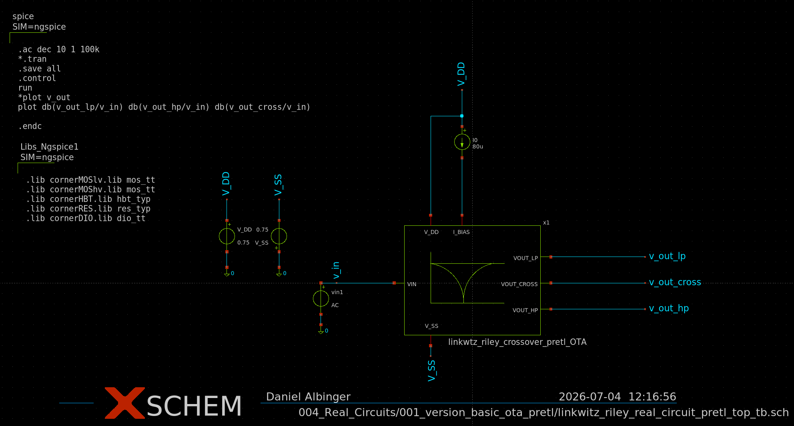

# Real circuits
This folder contains all attemps to convert the ideal linkwitz riley crossover into a real circuit design. There multiple different versions of the crossover circuit in this folder. Each one is based on a slightly different OTA. All testbenches are in a hierarchical schematic.
## Contents
| Folder  | Content |  Description   |
|-------|-----|-------|
| 000_ota_sizing_scripts | Sizing scripts  | Sizing scripts from Prof. Pretl. They are used to properly size the OTA |
| 001_version_basic_ota_pretl | Basic OTA | Contains a linkwitz-riley crossover based on the basic OTA from Prof. Pretl |
| 002_version_no_enable | OTA without enable circuit | Contains a linkwitz-riley crossover with a modified basic OTA from Prof. Pretl. The enable circuit of the OTA was removed for the sake of simplicity.  |
| 003_version_second_output_stage | OTA with extra Amplifier| Contains a linkwitz riley crossover based on the basic OTA without the enable circuit. There is an extra output amplifier added to it in order to achive more gain |

## linkwitz-riley crossover with the basic OTA from Prof. Pretl
This version of the linkwitz-riley crossover is based on the Basic OTA from Prof. Pretl. There are no modifications, besides the sizing, done to it. This design is the starting point for an own OTA design.

In order to size the OTA, the sizing script for the Basic OTA from Prof. Pretl is used.

## linkwitz-riley crossover with the modified OTA

## linkwitz-riley crossover with an added amplifier at its output

